# EduConnect

EduConnect est une application éducative mobile conçue pour offrir un apprentissage personnalisé aux élèves. Cette plateforme permet aux utilisateurs d'accéder à des cours, de suivre leur progression et d'améliorer leurs compétences académiques.

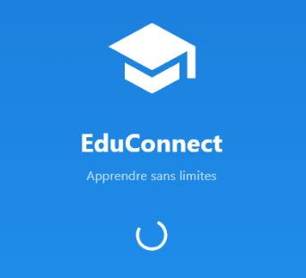

## Fonctionnalités

- Authentification des utilisateurs
- Catalogue de cours par matière
- Suivi de progression personnalisé
- Statistiques d'apprentissage
- Mode hors ligne
- Interface intuitive et adaptative

## Captures d'écran

### Écran de démarrage et authentification

<div style="display: flex; flex-wrap: wrap; gap: 10px; justify-content: center; align-items: center; align-content: center;">
  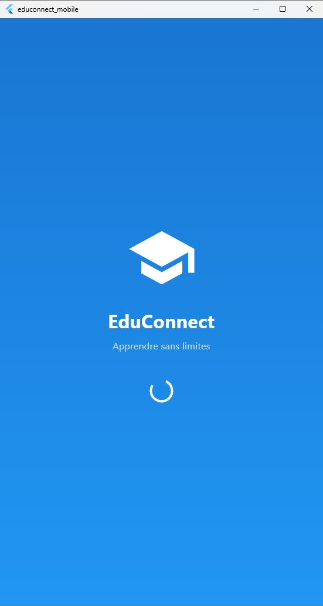
  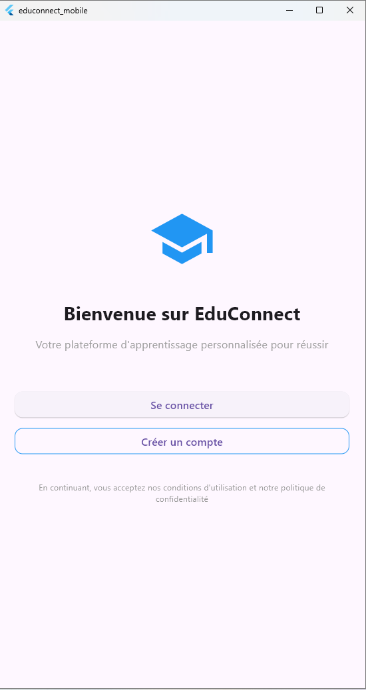
  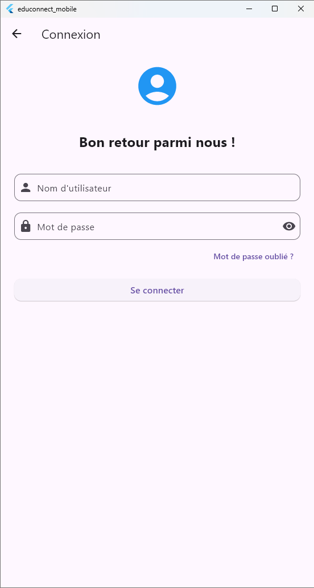
</div>

### Processus d'inscription

<div style="display: flex; flex-wrap: wrap; gap: 10px; justify-content: center; align-items: center; align-content: center;">
  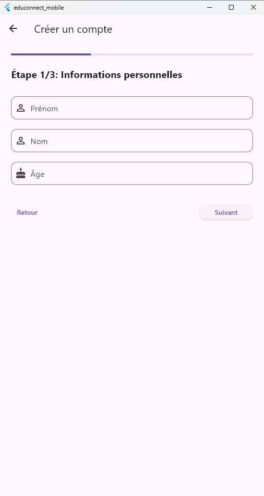
  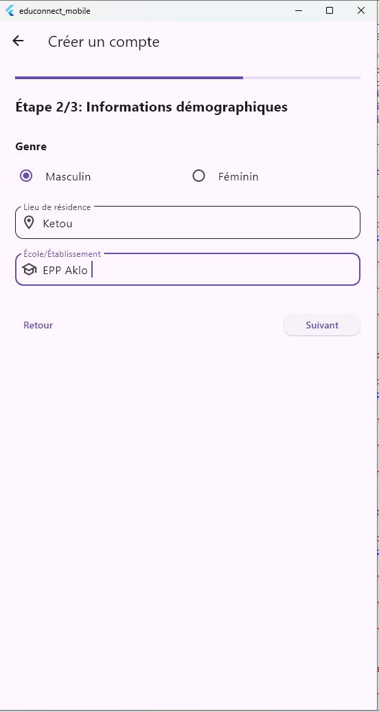
  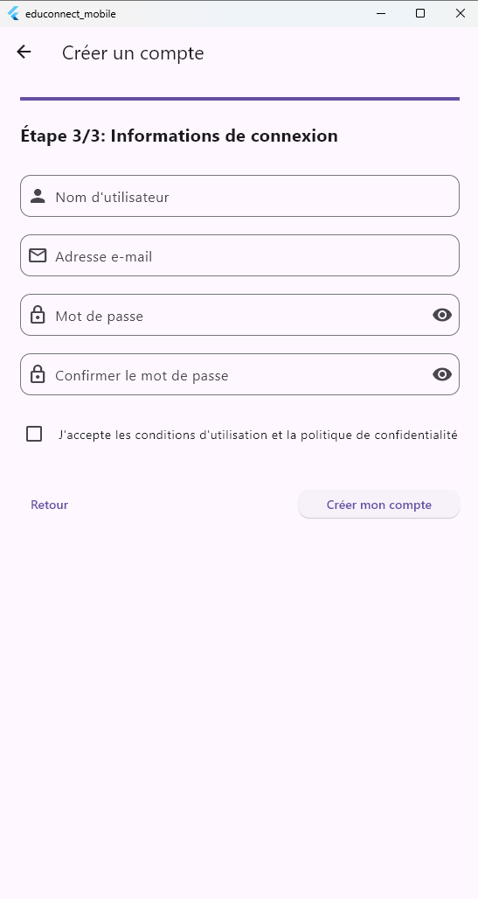
</div>

### Interface principale

<div style="display: flex; flex-wrap: wrap; gap: 10px; justify-content: center; align-items: center; align-content: center;">
  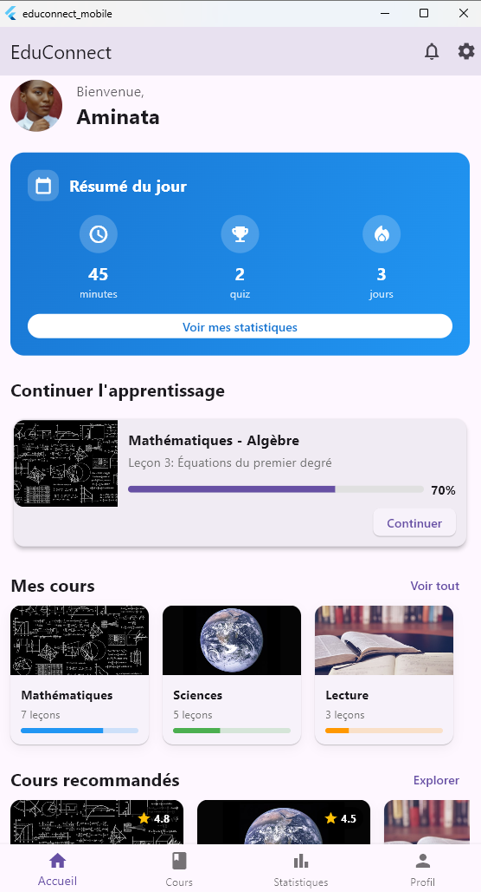
    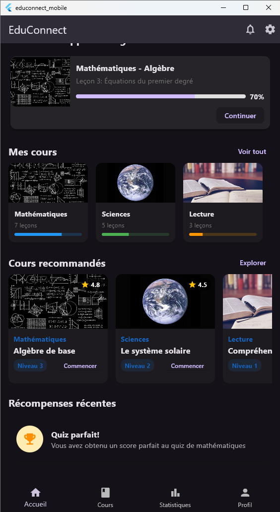
  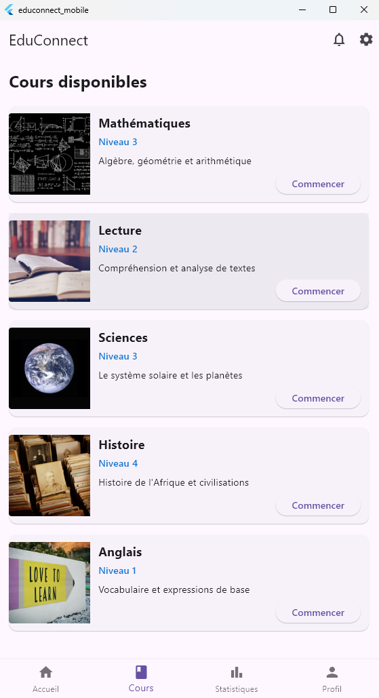
  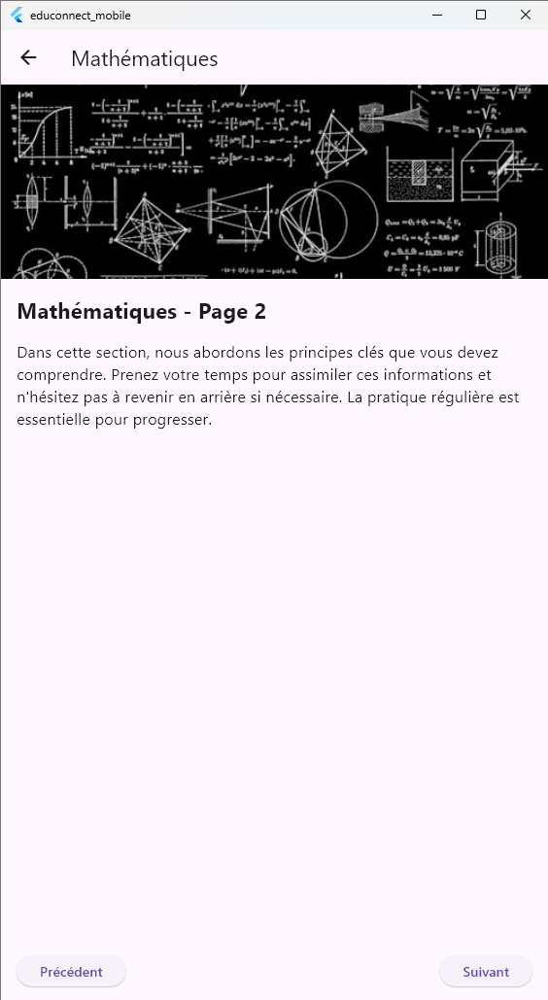
</div>

### Statistiques et profil

<div style="display: flex; flex-wrap: wrap; gap: 10px; justify-content: center; align-items: center; align-content: center;">
  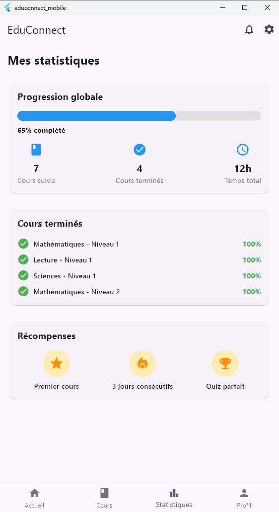
  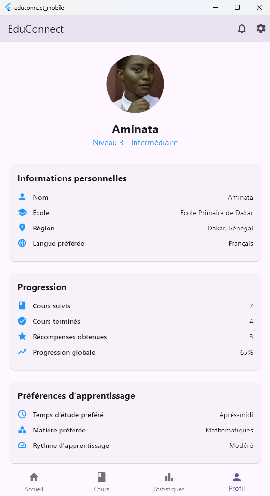
  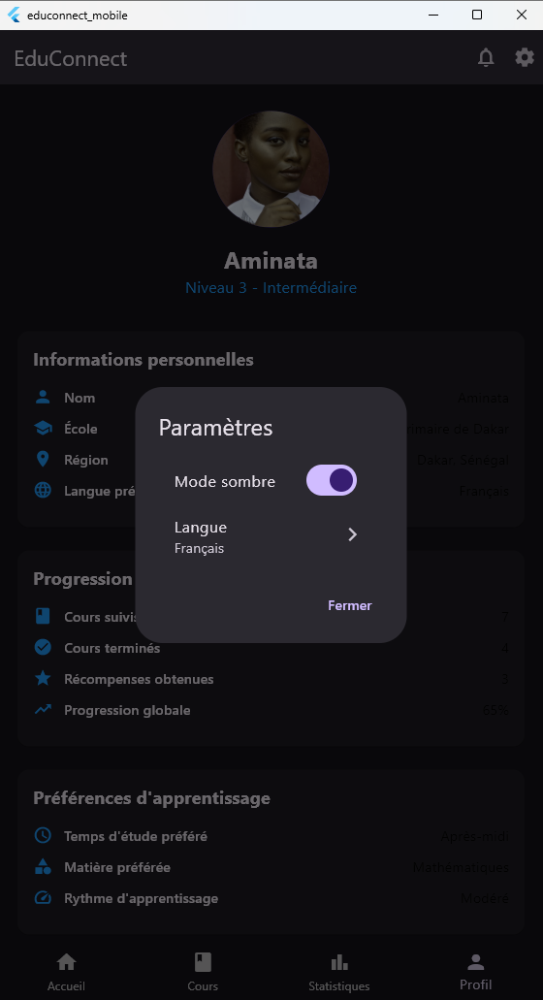
</div>

## Technologies utilisées

- Flutter
- Dart
- Provider pour la gestion d'état
- SharedPreferences pour le stockage local
- CachedNetworkImage pour l'optimisation des images

## Installation

1. Assurez-vous d'avoir Flutter installé sur votre machine
2. Clonez ce dépôt

```bash
git clone https://github.com/stephene369/EducConnect-unicef.git
```

3. Naviguez vers le répertoire du projet

```bash
cd EducConnect-unicef
```

4. Installez les dépendances

```bash
flutter pub get
```

5. Lancez l'application

```bash
flutter run
```

## Contribution

Les contributions sont les bienvenues ! N'hésitez pas à ouvrir une issue ou à soumettre une pull request.

1. Forkez le projet
2. Créez votre branche de fonctionnalité (`git checkout -b feature/amazing-feature`)
3. Committez vos changements (`git commit -m 'Add some amazing feature'`)
4. Poussez vers la branche (`git push origin feature/amazing-feature`)
5. Ouvrez une Pull Request

## Licence

Ce projet est sous licence MIT - voir le fichier [LICENSE](LICENSE) pour plus de détails.

## Contact

Stephene - [@stephene369](https://github.com/stephene369)

Lien du projet: [https://github.com/stephene369/EducConnect-unicef](https://github.com/stephene369/EducConnect-unicef)

## Remerciements

- UNICEF pour le soutien au projet
- Tous les contributeurs qui ont participé à ce projet
- La communauté Flutter pour ses ressources et son support
